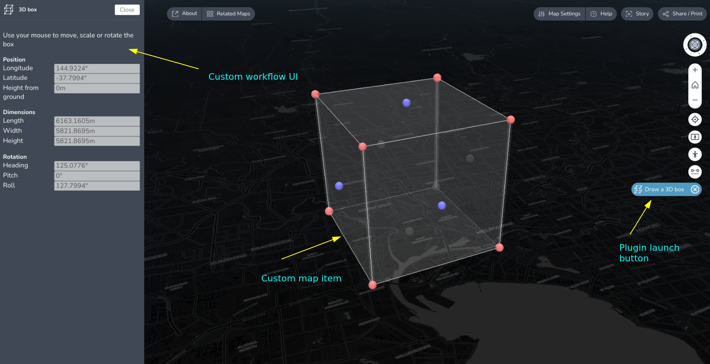

# TerriaJS sample plugin

This repository implements a sample TerriaJS plugin. The plugin implements a
custom tool for drawing an interactive 3D box on the map. It serves as an
example for setting up an loading an external plugin library that adds some new
functionality to Terria without forking it.

Plugins allow extending Terria in two ways:

  - By adding support for new data formats or APIs through implementing new [catalog item ](https://docs.terria.io/guide/connecting-to-data/catalog-items/) types. 
  - and extending the UI in limited ways to create custom workflows.

This plugin code utilizes these additional peer dependencies from the TerriaJS
library and are pre-requisites for understanding the code:

- [terriajs-plugin-api](https://github.com/terriajs/plugin-api) - for interfacing with the TerriaJS library.
- [CesiumJS](https://github.com/cesiumgs/cesium/) - The 3D mapping library
- [mobx](https://mobx.js.org/) - Reactive state management library
- [ReactJS](https://react.dev/)
- [styled-components](https://styled-components.com/)
- [yarn](yarnpkg.com) - Package manager


Additional documentation for developing with terria is available at
[https://docs.terria.io](https://docs.terria.io/). You can also reach us through our [discussion forum](https://github.com/TerriaJS/terriajs/discussions) if you require additional help.


This plugin repository is a work in progress and will be updated as the different
APIs evolve. Meanwhile expect breaking changes 👷

### Current status
- [x] Load external plugins in TerriaJS at build time
- [x] Support for registering custom data types (aka catalog items)
- [x] Initial, limited support for extending UI to add custom workflows
- [ ] Testing
- [ ] Linting

# Adding the plugin to your terriamap

### Clone terriamap
```bash
git clone https://github.com/terriajs/terriamap
cd terriamap
```

### Add this plugin as dependency in package.json
```bash
yarn add -W 'terriajs-plugin-sample'
```

### Add it to the plugin registry file `plugins.ts`
```typescript
const plugins: any[] = [
  import("terriajs-plugin-sample")
];
...
export default plugins;
```

Note: The file `plugins.ts` is in the terriamap project root directory.

### Now build your terriamap and start the server

```
# From the terriamap directory run
yarn run gulp dev
```

Once the server is running visit http://localhost:3001 to load the app. You should see a new plugin button added to the map toolbar on the right hand side. Opening the tool will prompt the user to draw a rectangle on the map, this will place a 3d box of the same dimension on the map. Screenshot of the plugin in action:



# Plugin development workflow

Developing the plugin requires correctly setting up the yarn workspace. Your local directory structure should look something like:
```
terriamap/
  packages/
  ├── plugin-sample
  └── terriajs
```

The `terriajs` and  `plugin-sample` repositories must be checked out under `terriamap/packages/` folder


### Checkout terriajs and sample-plugin into the packages folder

```bash
cd terriamap/
mkdir -p packages
git clone https://github.com/terriajs/terriajs packages/terriajs
git clone https://github.com/terriajs/plugin-sample packages/plugin-sample
```

### Add the plugin package to the [yarn workspace](https://classic.yarnpkg.com/lang/en/docs/workspaces/) settings of your terriamap `package.json` file.

Edit `package.json` for terriamap:

```json
  {
  "private": true,
  "workspaces": {
    "packages": [
      "packages/terriajs",
      "packages/cesium",
      "packages/terriajs-server"
      "packages/plugin-sample" // <-- plugin-sample added here
    ],

   ...
   
   "dependencies": {
    "terriajs-plugin-api": "0.0.1-alpha.16",
    "terriajs-plugin-sample": "0.0.1-alpha.8", // <-- plugin-sample version should match the version in packages/plugin-sample/package.json
```

### Build terriamap 

From your `terriamap` folder run:

```bash
yarn install
# Starts a terriamap dev server that watches for code changes and rebuilds the map
yarn run gulp dev
```

### Build plugin-sample

```bash
cd terriamap/packages/plugin-sample
# Start a plugin build process that watches for file changes
yarn run watch
```

Start making make changes to the plugin code, terriamap will automatically
rebuild the changes. Note that the page doesn't reload automatically, so you
will need to refresh to see the changes.
